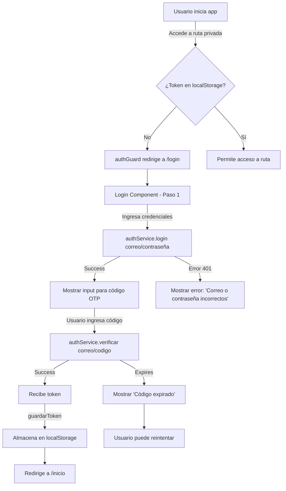

# 📊 Análisis Completo - Frontend Corredor Azul

**Proyecto:** ProyectoCorredorAzul - Frontend  
**Versión Angular:** 21.2.0  
**Tecnología:** Angular Standalone Components + RxJS  
**Ubicación:** `d:\Octavo ciclo\Solucionesweb\ProyectoCorredorAzul\Frontend`

---

## 🏗️ 1. ESTRUCTURA GENERAL

### Organización del Proyecto

```
src/app/
├── app.ts                    # Componente raíz (standalone)
├── app.config.ts             # Configuración de providers
├── app.routes.ts             # Definición de rutas
│
├── services/
│   └── auth.ts              # Servicio de autenticación
│
├── guards/
│   └── auth-guard.ts        # Guard de protección de rutas
│
├── components/              # Componentes reutilizables
│   ├── navbar/
│   └── headbot/
│
├── Pages/                   # Páginas/Vistas principales
│   ├── login/
│   ├── registro/
│   ├── olvidecontra/
│   ├── resetpassword/
│   ├── inicio/              # Página principal usuario
│   ├── user/                # Sección usuario autenticado
│   │   ├── verbuses/
│   │   ├── ubicacion/
│   │   ├── recargas/
│   │   ├── canalatencion/
│   │   ├── noticias/
│   │   ├── preguntasfrecuentes/
│   │   ├── rutas-favoritas/
│   │   ├── soporte/
│   │   └── verestaciones/
│   └── admin/               # Sección administrador
│       ├── dashboard/
│       └── inicio/
│
└── assets/                  # Recursos estáticos
    └── liveline-wc/         # Web Component para liveline
```

### Características de Implementación

- ✅ **Standalone Components**: No usa NgModules, componentes independientes
- ✅ **Routing con Hash Location**: Rutas con `#` para compatibilidad
- ✅ **Reactive Forms**: Validación de formularios con ReactiveFormsModule
- ✅ **Inyección de dependencias**: Servicios providedIn: 'root'
- ✅ **localStorage**: Manejo de tokens y sesión en cliente
- ✅ **Animaciones**: Transiciones personalizadas con `@angular/animations`

---

## 📋 2. INTERFACES Y TIPOS DEFINIDOS

### 2.1 Interfaces de Autenticación (auth.ts)

```typescript
// Solicitudes de API
export interface LoginRequest {
  correo: string;
  contrasena: string;
}

export interface VerificarRequest {
  correo: string;
  codigo: string;  // Código OTP de 6 dígitos
}

export interface RegistroRequest {
  nombre: string;
  apellido1: string;
  apellido2?: string;  // Opcional
  tipoDocumento: string;
  numDocumento: string;
  telefono: string;
  correo: string;
  contrasena: string;
}

export interface ResetPasswordRequest {
  token: string;
  nuevaContrasena: string;
}

// Respuestas de API
export interface MensajeResponse {
  mensaje: string;
}

export interface TokenResponse {
  token: string;
  mensaje: string;
}
```

### 2.2 Interfaces del Dashboard (dashboard.ts)

```typescript
export interface KpiDashboard {
  usuariosActivos: number;
  busesEnFlota: number;
  recargasHoy: number;
  montoRecargasHoy: number;
  reportesEnviados: number;
  reportesPendientes: number;
}

export interface UsuarioReciente {
  iniciales: string;
  avatarClass: string;
  nombre: string;
  ruta: string;
  hace: string;           // "hace 5 mins"
  rol: string;
  rolClass: string;
}

export interface EtaItem {
  linea: string;
  color: string;
  tiempo: number;
  barPct: number;
  tiempoColor: string;
  tiempoBg: string;
  paradero: string;
}

export interface NoticiaVisita {
  titulo: string;
  fecha: string;
  autor: string;
  vistas: number;
  dotColor: string;
}

export interface LineaViaje {
  nombre: string;
  viajes: number;
  pct: number;
}

export interface EventoImpacto {
  nombre: string;
  fecha: string;
  lugar: string;
  semana: string;
  tipo: 'alto' | 'medio' | 'festivo';
  impactoLabel: string;
  emoji: string;
  rutas: string[];
}
```

### 2.3 Interfaces Locales de Componentes

#### Navbar (navbar.ts)
```typescript
interface Notificacion {
  id: number;
  tipo: 'operativa' | 'saldo';
  titulo: string;
  descripcion: string;
  hora: string;
  leida: boolean;
}
```

#### Inicio Usuario (inicio.ts)
```typescript
interface Tarjeta {
  id: string;
  alias: string;
  empresa: string;
  codigo: string;
  imagen: string;
}
```

---

## 🔐 3. FLUJO DE AUTENTICACIÓN Y AUTORIZACIÓN

### 3.1 Flujo Paso a Paso



### 3.2 AuthService - Métodos

```typescript
@Injectable({ providedIn: 'root' })
export class AuthService {

  // ── AUTENTICACIÓN ──
  login(body: LoginRequest): Observable<MensajeResponse>
    → POST /api/v1/auth/login
    → Respuesta: { mensaje: string }

  verificar(body: VerificarRequest): Observable<TokenResponse>
    → POST /api/v1/auth/verificar
    → Respuesta: { token: string; mensaje: string }

  reenviar(correo: string): Observable<MensajeResponse>
    → POST /api/v1/auth/reenviar
    → Reenvía código OTP al correo

  // ── RECUPERACIÓN DE CONTRASEÑA ──
  recuperar(correo: string): Observable<MensajeResponse>
    → POST /api/v1/auth/recuperar
    → Inicia flujo de recuperación

  validarToken(token: string): Observable<MensajeResponse>
    → GET /api/v1/auth/validar-token?token={token}
    → Valida si token es válido

  resetPassword(body: ResetPasswordRequest): Observable<MensajeResponse>
    → POST /api/v1/auth/reset-password
    → { token, nuevaContrasena }

  // ── REGISTRO ──
  registro(body: RegistroRequest): Observable<any>
    → POST /api/v1/auth/registro
    → Transforma estructura: apellido1 + apellido2 → apellidos

  // ── SESIÓN ──
  guardarToken(token: string): void
    → localStorage.setItem('auth_token', token)

  obtenerToken(): string | null
    → localStorage.getItem('auth_token')

  cerrarSesion(): void
    → localStorage.removeItem('auth_token')

  estaAutenticado(): boolean
    → !!this.obtenerToken()
}
```

### 3.3 AuthGuard

```typescript
export const authGuard: CanActivateFn = () => {
  const auth = inject(AuthService);
  const router = inject(Router);

  if (auth.estaAutenticado()) {
    return true;  // Permite acceso
  }

  router.navigate(['/login']);  // Redirige a login
  return false;  // Denega acceso
};
```

**Nivel de seguridad:** ⚠️ Básico (solo verifica presencia de token)
- No valida token con backend
- No verifica roles/permisos
- No maneja expiración de token

---

## 🛣️ 4. RUTAS DEFINIDAS (app.routes.ts)

### Rutas Públicas (sin autenticación)

| Ruta | Componente | Descripción |
|------|-----------|-------------|
| `/` | - | Redirecciona a `/login` |
| `/login` | `LoginComponent` | Página de inicio de sesión |
| `/registro` | `RegistroComponent` | Registro de nuevo usuario |
| `/olvidecontra` | `OlvidecontraComponent` | Recuperación de contraseña |
| `/reset-password` | `ResetPasswordComponent` | Resetear contraseña con token |

### Rutas Privadas (requieren authGuard)

#### Sección Usuario Autenticado

| Ruta | Componente | Descripción |
|------|-----------|-------------|
| `/inicio` | `InicioComponent` | Dashboard del usuario |
| `/user/verbuses` | `VerBusesComponent` | Ver buses disponibles |
| `/user/ubicacion` | `UbicacionComponent` | Ubicación en tiempo real |
| `/user/recargas` | `RecargasComponent` | Recargar tarjeta |
| `/user/canalatencion` | `CanalAtencionComponent` | Canal de atención al cliente |
| `/user/noticias` | `NoticiasComponent` | Noticias del sistema |
| `/user/faq` | `PreguntasFrecuentesComponent` | Preguntas frecuentes |
| `/noticias/todas` | `TodasComponent` | Ver todas las noticias |
| `/user/noticias/ver-noticia` | `VerNoticiaComponent` | Detalle de noticia |
| `/rutas-favoritas` | `RutasFavoritasComponent` | Rutas favoritas del usuario |

#### Sección Admin

| Ruta | Componente | Descripción |
|------|-----------|-------------|
| `/dashboarda` | `DashboardComponent` | Dashboard administrativo |
| `/inicia` | `IniciAdminComponent` | Página inicio admin |

⚠️ **Nota:** Las rutas admin `/dashboarda` e `/inicia` también están protegidas por `authGuard`, pero **no implementan validación de rol**. Cualquier usuario autenticado puede acceder.

---

## 🧩 5. SERVICIOS Y RESPONSABILIDADES

### AuthService (services/auth.ts)

**Responsabilidades:**
1. ✅ Comunicación con backend de autenticación
2. ✅ Gestión de tokens en localStorage
3. ✅ Validación de sesión en cliente
4. ✅ Endpoints de login, registro y recuperación

**Métodos públicos:**
- `login()` - Autenticar usuario
- `verificar()` - Verificar código OTP
- `registro()` - Registrar nuevo usuario
- `recuperar()` - Iniciar recuperación de contraseña
- `resetPassword()` - Actualizar contraseña
- `guardarToken()` / `obtenerToken()` - Gestión de token
- `cerrarSesion()` - Limpiar sesión
- `estaAutenticado()` - Verificar sesión activa

**Problemas identificados:**
- ⚠️ No hay servicio de API genérico (cada componente hace peticiones propias)
- ⚠️ No hay interceptor HTTP para inyectar token
- ⚠️ No hay manejo de errores centralizado
- ⚠️ No hay servicio para otros recursos (noticias, rutas, buses, etc.)

---

## 📱 6. COMPONENTES POR SECCIÓN

### 6.1 Componentes Públicos (sin autenticación)

#### **LoginComponent** (`Pages/login/login.ts`)
```
Responsabilidad: Autenticación en 2 pasos (credenciales + OTP)

Propiedades principales:
- paso: number (1 = credenciales, 2 = código)
- loginForm: FormGroup (email, password, remember)
- codigoForm: FormGroup (código de 6 dígitos)
- tiempoRestante: number (contador para expiración)
- loading: boolean
- errorMessage: string

Métodos:
- onSubmit(): Valida y envía credenciales
- verificarCodigo(): Valida y verifica código OTP
- iniciarCountdown(): Inicia contador de 5 minutos

Flujo:
1. Usuario ingresa correo/contraseña → onSubmit()
2. AuthService.login() → paso = 2
3. Usuario ingresa código OTP → verificarCodigo()
4. AuthService.verificar() → obtiene token
5. Redirige a /inicio

Validaciones:
- Email debe ser válido (RFC)
- Contraseña requerida
- Código debe ser exactamente 6 dígitos
- Código no debe estar expirado (5 minutos)
```

#### **RegistroComponent** (`Pages/registro/registro.ts`)
```
Responsabilidad: Registro de nuevo usuario

Campos capturados:
- nombre
- apellido1, apellido2 (opcional)
- tipoDocumento, numDocumento
- telefono
- correo
- contrasena

Transformación antes de enviar:
- apellido1 + apellido2 → apellidos (concatenados)
- nombres → nombre
- nroDocumento → numDocumento

Animaciones incluidas: fadeSlideInLeft, staggerItems, fadeSlideInUp
```

#### **OlvidecontraComponent** (`Pages/olvidecontra/olvidecontra.ts`)
```
Responsabilidad: Iniciar recuperación de contraseña

Flujo:
1. Usuario ingresa correo
2. AuthService.recuperar(correo)
3. Recibe token de recuperación
4. Redirige a pantalla de reset-password
```

#### **ResetPasswordComponent** (`Pages/resetpassword/resetpassword.ts`)
```
Responsabilidad: Resetear contraseña con token válido

Datos necesarios:
- token (desde URL o sessionStorage)
- nuevaContrasena

Llamada: AuthService.resetPassword({ token, nuevaContrasena })
```

### 6.2 Componentes Usuario Autenticado

#### **InicioComponent** (`Pages/inicio/inicio.ts`)
```
Responsabilidad: Dashboard/home del usuario

Características:
- Carrusel de tarjetas de recarga
- Información de saldo
- Acceso rápido a funciones
- Historial de transacciones

Interfaz Tarjeta:
{
  id: string
  alias: string (ej: "Mi tarjeta principal")
  empresa: string
  codigo: string
  imagen: string
}

Animaciones: fadeSlideIn
Integración: NavbarComponent
```

#### **VerBusesComponent** (`Pages/user/verbuses/verbuses.ts`)
```
Responsabilidad: Mostrar buses disponibles en tiempo real
Integración: Navbar, posiblemente mapa o ubicación
```

#### **UbicacionComponent** (`Pages/user/ubicacion/ubicacion.ts`)
```
Responsabilidad: Ubicación del usuario en tiempo real
Integración: Mapa, tracking de buses
```

#### **RecargasComponent** (`Pages/user/recargas/recargas.ts`)
```
Responsabilidad: Recargar tarjeta/saldo
Integración: Navbar, formularios de pago
```

#### **CanalAtencionComponent** (`Pages/user/canalatencion/canalatencion.ts`)
```
Responsabilidad: Soporte y atención al cliente
Integración: Navbar, formularios de contacto
```

#### **NoticiasComponent** (`Pages/user/noticias/noticias.ts`)
```
Responsabilidad: Listar noticias del sistema
```

#### **TodasComponent** (`Pages/user/noticias/todas/todas.ts`)
```
Responsabilidad: Ver todas las noticias (paginado)
```

#### **VerNoticiaComponent** (`Pages/user/noticias/ver-noticia/ver-noticia.ts`)
```
Responsabilidad: Detalle completo de una noticia
```

#### **PreguntasFrecuentesComponent** (`Pages/user/preguntasfrecuentes/preguntasfrecuentes.ts`)
```
Responsabilidad: FAQ del sistema
```

#### **RutasFavoritasComponent** (`Pages/user/rutas-favoritas/rutas-favoritas.ts`)
```
Responsabilidad: Gestionar rutas favoritas del usuario
```

#### **SoporteComponent** (`Pages/user/soporte/soporte.ts`)
```
Responsabilidad: Enviar reportes de problemas
```

#### **VerEstacionesComponent** (`Pages/user/verestaciones/...`)
```
Responsabilidad: Listar y ver detalles de estaciones
```

### 6.3 Componentes Admin

#### **DashboardComponent** (`Pages/admin/dashboard/dashboard.ts`)
```
Responsabilidad: Dashboard administrativo con analytics

Datos mostrados (KPI):
- usuariosActivos: 3241
- busesEnFlota: 38
- recargasHoy: 412
- montoRecargasHoy: 6180
- reportesEnviados: 14
- reportesPendientes: 3

Secciones:
- KPIs principales
- Usuarios recientes
- ETA de buses
- Noticias más vistas
- Líneas con más viajes
- Eventos de alto impacto

Integración: Gráficos (ng2-charts), Canvas rendering, Navbar
```

#### **IniciAdminComponent** (`Pages/admin/inicio/inicio.ts`)
```
Responsabilidad: Home/inicio de sección admin
```

### 6.4 Componentes Reutilizables

#### **NavbarComponent** (`components/navbar/navbar.ts`)
```
Responsabilidad: Barra de navegación

Características:
- Menú de usuario
- Notificaciones (operativas y saldo)
- Modal de logout
- Modal de reporte de problemas
- Tipos de reportes predefinidos (16 categorías):
  * Estación: aglomeración, módulo recarga, torniquete, limpieza, inseguridad
  * Bus: no llega, lleno, mal estado, conducta conductor, desvío ruta, velocidad
  * Tarjeta: no carga, descuento, no se lee, perdida
  * App: saldo incorrecto, error
  * Otro

Interfaz Notificacion:
{
  id: number
  tipo: 'operativa' | 'saldo'
  titulo: string
  descripcion: string
  hora: string
  leida: boolean
}

Emite: logout (EventEmitter)
```

#### **HeadbotComponent** (`components/headbot/headbot.ts`)
```
Responsabilidad: Chat bot en la esquina (Web Component)

Características:
- Carga script de liveline (headBot.js)
- Se muestra en todas las rutas EXCEPTO:
  * /login
  * /registro
  * /olvidecontra
  * /reset-password

Implementa: OnInit, OnDestroy
```

---

## 📦 7. DEPENDENCIAS PRINCIPALES (package.json)

### Versiones

```json
{
  "version": "0.0.0",
  "packageManager": "npm@11.8.0",

  // ANGULAR (v21.2.0)
  "@angular/animations": "^21.2.10",
  "@angular/common": "^21.2.0",
  "@angular/compiler": "^21.2.0",
  "@angular/core": "^21.2.0",
  "@angular/forms": "^21.2.0",      // Reactive Forms
  "@angular/platform-browser": "^21.2.0",
  "@angular/router": "^21.2.0",

  // GRÁFICOS Y VISUALIZACIÓN
  "chart.js": "^4.5.1",
  "ng2-charts": "^10.0.0",

  // UTILIDADES
  "rxjs": "~7.8.0",                 // Observables
  "tslib": "^2.3.0",

  // WEB COMPONENTS
  "liveline": "^0.0.7",             // Bot/Chat
  "react": "^19.2.6",               // Para liveline-wc
  "react-dom": "^19.2.6",

  // DEV DEPENDENCIES
  "@angular/build": "^21.2.5",
  "@angular/cli": "^21.2.5",
  "@angular/compiler-cli": "^21.2.0",
  "@tailwindcss/postcss": "^4.1.12", // CSS Framework
  "tailwindcss": "^4.1.12",
  "postcss": "^8.5.3",
  "typescript": "~5.9.2",
  "vitest": "^4.0.8",               // Testing framework
  "prettier": "^3.8.1",
  "jsdom": "^28.0.0"
}
```

### Stack Tecnológico

- **Framework:** Angular 21 (últimas características)
- **Lenguaje:** TypeScript 5.9
- **Routing:** Angular Router con Hash Location
- **Formularios:** Reactive Forms
- **Styling:** Tailwind CSS + PostCSS
- **Charts:** Chart.js + ng2-charts
- **State Management:** RxJS Observables (sin NgRx)
- **Testing:** Vitest + JSDOM
- **Backend:** API REST en `http://localhost:8080/api/v1`

---

## 🔄 8. FLUJOS PRINCIPALES

### Flujo 1: Autenticación Completa

```
1. Usuario accede a aplicación
   ↓
2. App intenta cargar ruta /inicio
   ↓
3. authGuard verifica localStorage.auth_token
   ↓
4. Si no existe → redirige a /login
   ↓
5. LoginComponent muestra paso 1 (credenciales)
   ↓
6. Usuario ingresa correo/contraseña
   ↓
7. POST /api/v1/auth/login
   ↓
8. Si success → LoginComponent muestra paso 2 (código OTP)
   ↓
9. Usuario ingresa código (6 dígitos)
   ↓
10. POST /api/v1/auth/verificar
    ↓
11. Si success → recibe { token, mensaje }
    ↓
12. authService.guardarToken(token)
    ↓
13. Router.navigate(['/inicio'])
    ↓
14. authGuard verifica token → acceso concedido
    ↓
15. InicioComponent carga
```

### Flujo 2: Recuperación de Contraseña

```
1. Usuario en /login → click "¿Olvidaste contraseña?"
   ↓
2. Redirige a /olvidecontra
   ↓
3. Usuario ingresa correo
   ↓
4. POST /api/v1/auth/recuperar?correo=...
   ↓
5. Backend envía link/token por correo
   ↓
6. Usuario clica link en correo → /reset-password?token=...
   ↓
7. ResetPasswordComponent carga
   ↓
8. Usuario ingresa nueva contraseña
   ↓
9. POST /api/v1/auth/reset-password { token, nuevaContrasena }
   ↓
10. Si success → redirige a /login
    ↓
11. Usuario inicia sesión con nueva contraseña
```

### Flujo 3: Reporte de Problema (desde Navbar)

```
1. Usuario autenticado → click botón reporte en Navbar
   ↓
2. Modal de reporte abre
   ↓
3. Usuario selecciona tipo de problema (16 opciones)
   ↓
4. Se rellena automáticamente:
   - Título (ej: "Aglomeración peligrosa en estación")
   - Color (ej: naranja para estación, azul para bus)
   - Icono SVG del tipo
   ↓
5. Usuario opcionalmente:
   - Agrega descripción
   - Agrega imagen
   - Selecciona línea/ruta
   ↓
6. Envía reporte (POST a backend)
   ↓
7. Mensaje de éxito/error
   ↓
8. Modal se cierra
```

### Flujo 4: Navegación Protegida

```
Usuario → Click en enlace privado
   ↓
¿Token existe en localStorage?
   ├─ NO → authGuard redirige a /login
   └─ SÍ → Carga componente

Nota: No valida:
- Expiración de token
- Rol del usuario
- Permisos específicos
```

---

## ⚠️ 9. PROBLEMAS Y MEJORAS IDENTIFICADAS

### Problemas Críticos

| # | Problema | Impacto | Solución |
|---|----------|--------|----------|
| 1 | No hay validación de token con backend | Alto | Implementar interceptor HTTP + endpoint de validación |
| 2 | No hay manejo de roles/permisos | Alto | Agregar roles en token JWT, validar en guards |
| 3 | Token nunca expira | Alto | Implementar refresh tokens + validación de expiración |
| 4 | No hay interceptor HTTP | Medio | Agregar interceptor para inyectar token en headers |
| 5 | Servicios solo para auth | Medio | Crear servicios para noticias, buses, rutas, etc. |

### Problemas de Seguridad

- ⚠️ Token en localStorage (vulnerable a XSS)
- ⚠️ Sin CSRF protection
- ⚠️ Sin rate limiting en frontend
- ⚠️ Contraseñas viajan en POST sin encriptación (SSL previene)
- ⚠️ Sin manejo de timeouts de sesión

### Mejoras Funcionales

1. **Crear servicio API genérico** para todas las llamadas
2. **Implementar store de estado** (estado de usuario, notificaciones, etc.)
3. **Agregar error handling centralizado**
4. **Lazy loading** de rutas para performance
5. **Validación de formularios más robusta**
6. **Internacionalización (i18n)** para otros idiomas

---

## 📊 10. RESUMEN TÉCNICO

| Aspecto | Detalles |
|--------|----------|
| **Tipo de Aplicación** | SPA (Single Page Application) |
| **Componentes** | 15+ standalone components |
| **Rutas** | 14 públicas + 11 privadas = 25 total |
| **Interfaces/Tipos** | 13+ interfaces definidas |
| **Servicios** | 1 servicio (AuthService) |
| **Guards** | 1 guard (authGuard) |
| **Animaciones** | Transiciones personalizadas |
| **Styling** | Tailwind CSS |
| **Testing Framework** | Vitest |
| **Backend API** | http://localhost:8080/api/v1 |
| **Autenticación** | 2FA (OTP por correo) |
| **Token Storage** | localStorage (auth_token) |
| **Interceptores** | Ninguno |

---

## 🎯 11. PRÓXIMOS PASOS RECOMENDADOS

### Corto Plazo (Urgente)
1. ✅ Agregar validación de token en backend
2. ✅ Implementar HTTP interceptor
3. ✅ Agregar manejo de errores centralizado
4. ✅ Implementar refresh tokens

### Mediano Plazo
1. ✅ Sistema de roles y permisos
2. ✅ Servicios para cada recurso (noticias, buses, rutas)
3. ✅ State management (NgRx o Signal State)
4. ✅ Lazy loading de rutas

### Largo Plazo
1. ✅ Pruebas unitarias e integración
2. ✅ Internacionalización
3. ✅ PWA capabilities
4. ✅ Optimización de performance

---

**Análisis completado:** 27 May 2026  
**Versión:** 1.0
